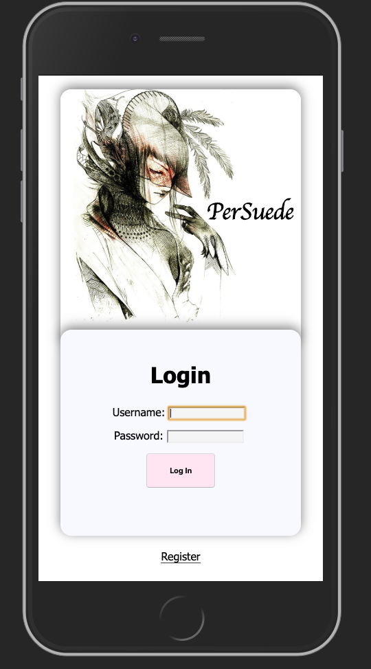
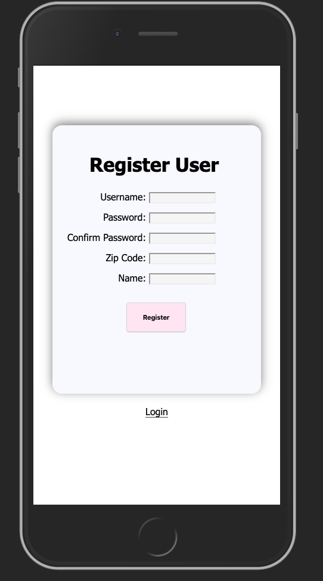
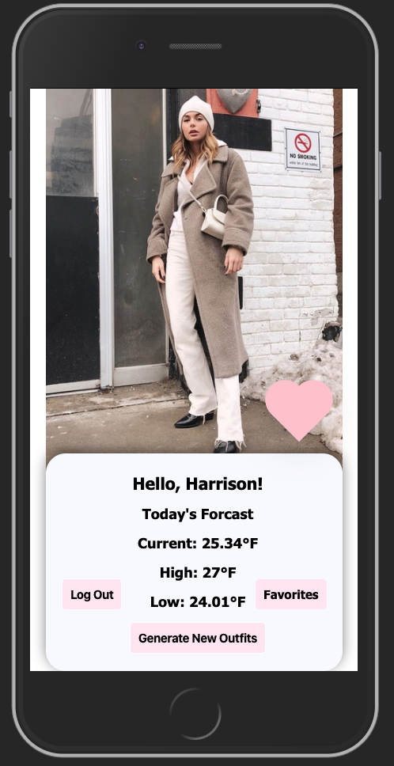
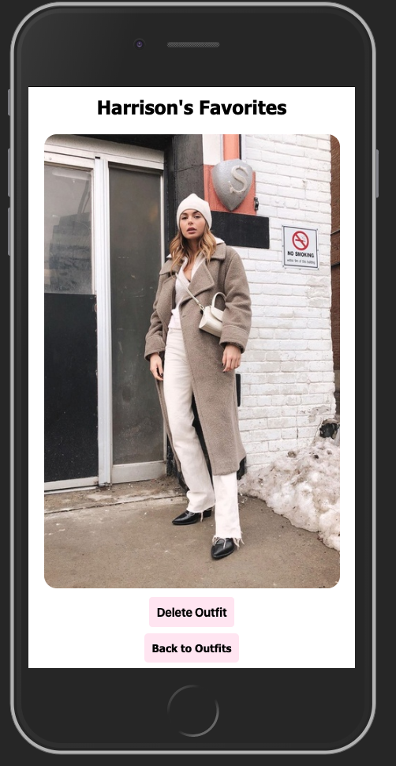
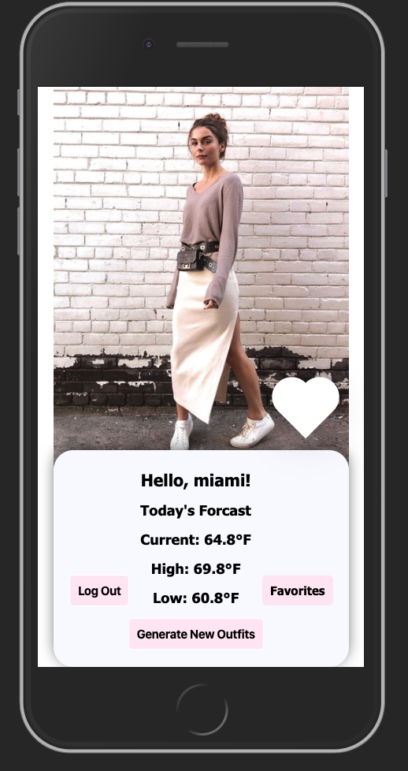

# Solo Project: PerSuede

## Description

Duration: 2 week sprint

PerSuede is a mobile-first application that helps users save time on deciding what to wear for the day by using data from a weather API as well as a fashion API to send them outfit recommendations that they can save by favoriting and deleting. There is also an admin page where admins can add more outfits to the fashion API database.
<!-- To see the fully functional site, please visit: DEPLOYED VERSION OF APP -->

## Wireframe

### Login Page

### Registration Page

### Landing Page

### Favorites Page

### Different outfit based on weather feature

<!-- ### Admin Page
 -->

### Prerequisites

https://nodejs.org/en/

## Installation
This is a step by step list for how another developer could get this project up and running.

1. Create a database called PerSuede_app
2. The queries in the tables.sql file are set up to create all the necessary tables and populate the needed data to allow the application to run correctly. The project is built on Postgres, so you will need to make sure to have that installed. I recommend using Postico to run those queries as that was used to create the queries.
3. Open up your editor of choice and run an npm install
4. Run npm run server in your terminal
5. Run npm run client in your terminal
6. The npm run client command will open up a new browser tab for you!

## Usage
You can use this applicaiton to help you decide on what to wear based on the weather as well as input your own outfits.

## Built With
* SERN Stack
    * SQL
    * Express.js
    * React.js  
    * React-redux
    * Node.js
    * Material UI
    * PostgreSQL
    * Postico
    * CSS3
    * HTML5

## Acknowledgement
Thanks to Prime Digital Academy in Minneapolis who helped me make this application a reality.

## Support
If you have suggestions or issues, please email me at harrisonnguyen517@gmail.com
